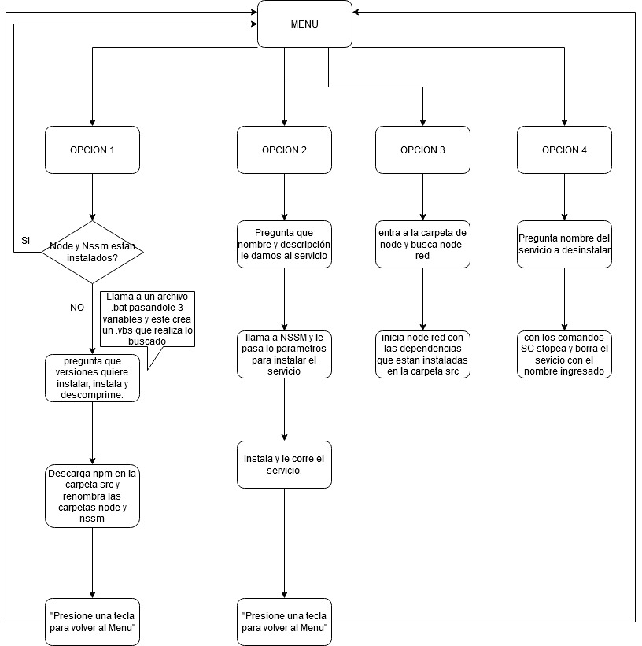

   
   
--EN PROCESO 12/10/22
  # Grain Vision Web Service
El programa desarrollado en Node-red tiene como objetivo recolectar los datos generados por GrainVision en formato de texto y los ingresa a una DB sin que el disco se llene (gracias a que purgamos la DB), esos datos son enviados al servidor web a través del protocolo HTTP.

Este proyecto fue desarrollado por IEA (Ingeniería Electrónica Argentina).

  # Programas utilizados

* [Node.js](https://nodejs.org/dist/v16.13.2/): 

* [npm](https://nodered.org/): 

* [nssm](https://nssm.cc/download): 

 
  

 # Installation
RECOMENDACIÓN: Por defecto, instalar él .zip en una carpeta llamada C:\GRAINVSN\GVCLOUD.

Una vez instalado él .zip: 
- Abra el archivo install.bat **como administrador**.
- Vera un menú de opciones, elija la primera para instalar los programas de entorno para el proyecto (Node y Nssm).
- **Opción 1** Tenemos distintas versiones de node y nssm para instalar, seleccione la que quiera y se instalaran los programas y npm. En caso de que ya estén instalados, la opción les dirá "Ya están instaladas los programas node, nssm y npm". 
- Una vez instalado todo lo necesario le damos la opción de activar el proyecto de como **2**. Servicio de Windows  (Esto nos quita la incomodidad de tener que iniciar el node red, ya que cuando encendemos nuestra pc node comenzara a correr) o directamente **3.** iniciando node red.
- **Opcion 2**  Nos pedira que le demos nombre al servicio y una descripción. En caso de dejar las casillas vacias se le asignaran los valores predeterminados que son: Name: GrainVisionWebService. Description: Servicio de subida de datos de GrainVision Web. Luego solo tendremos que buscar en nuestro navegador este link http://127.0.0.1:1880
- **Opcion 3**  Una vez vez seleccionada NO CERRAMOS LA CMD y buscamos el link http://127.0.0.1:1880/ por nuestro navegador.
- **Opcion 4** Esta opcion borra Servicios de Windows, solo nos pedira el nombre del que desea eliminar. En caso de no completar se completara con el nombre predeterminado. Name: GrainVisionWebService.

**IMP para la opcion 2, 3 y 4 tiene que abrir el install.bat como administrador.**

  # Flows y Nodos ¿Cómo funciona?

Al ingresar a Node-red encontraremos varios flows que cumplen distintas funciones para llegar al objetivo, estos flujos están especificados acá:

  

 - **File Finder Data Archive**: En este flujo se buscan y leen las carpetas que contienen los archivos, se formatean y se envían como mensajes a la base de datos SQLite.

# Descripción detallada de carpetas

Al descargar él .zip nos encontramos con varios archivos que pasamos a detallar:

- **bin**  en esta carpeta veremos los programas node y nssm con sus respectivos .zip
- **database** que tiene la DB.
- **src** que tiene todo lo necesario para poder trabajar adentro del proyecto aqui se guarda npm. 
- **.git** alberga todo el contenido del repositorio utilizado por Git.
- **.vscode** archivo de vscode que contiene palabras que siempre considera correctas a la hora de escribir.
- **.gitignore** es un archivo  de texto que le dice a Git que archivos o carpetas ignorar.
- **install.bat** este archivo .bat instala el proyecto, descomprime los programas adicionales que necesitamos, descarga el npm y establece un servicio de Windows para que funciones el Node-red cuando prendemos la pc en caso de que lo desee. Esto está mas especificado en el apartado #Installation.
- **CHANGELOG** lista ordenada de forma cronológica y que especifica los cambios que se han ido realizando para cada versión de la aplicación.
- **README**  que contiene toda la información y explicación del programa. 
- **start.cmd**  start node.
- **Install_entorno.bat** crea el archivo _.vbs cuando seleccionamos la opcion 1, este .vbs instala y descomprime .zips.
-  **_vbs** crea y descomprime programas con las variables que le pasemos. 

# Descripción de las variables en el código.
GVCLOUDPATH es la direccion de la carpeta raiz.
SOURCE es la direccion de la carpeta src(donde estan las dependecias de node).
PATH esta variable es utilizada para descargar node e instalar las dependencias en la carpeta src.
GVBINPATH es la direccion de la carpeta raiz + \bin (carpeta donde se encuentran los programas instalados).
NODEJSPATH es la direccion a la carpeta nodejs.
NSSMPATH es la direccion a la carpeta nssm.

Esto tambien lo dejamos documentado en el código para que sea fácil la lectura cuando estemos codeando.

# Diagrama de flujo del proyecto.

